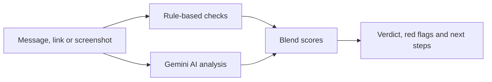

# 🛡️ ScamSense

**Paste a suspicious message, email, link or screenshot. Find out in seconds if it's a scam, why, and what to do next.**

**Live demo:** https://scamsenseai.streamlit.app/
**Hackathon:** HackNowa Global Hackathon 2026 · Track: Digital Safety & Cybersecurity

<!-- Add 2-3 screenshots to a /screenshots folder and uncomment these lines:


-->

## The problem

Scams reach people through ordinary text messages, emails and chat apps, and they are getting more convincing. The US Federal Trade Commission reported that consumers lost $15.9 billion to fraud in 2025, up from over $12 billion the year before, with imposter scams the most frequently reported type and text messages the top reported contact method.

Most people have no quick, trustworthy way to check a message *before* they click, reply or pay. Security tools are built for experts. Victims are often elderly, new to digital payments, or more comfortable in a language other than English.

## What ScamSense does

1. **Accepts what people actually receive:** pasted text, links, or a screenshot.
2. **Gives a clear verdict:** Safe, Suspicious or Dangerous, with a 0-100 risk score.
3. **Shows its evidence:** each red flag is tied to an exact quote from the message, and suspicious phrases are highlighted.
4. **Checks links:** look-alike domains (e.g. `paypa1.com`), shortened links, unusual domain endings, hidden `@` tricks, raw IP addresses and, when available, how recently a website was registered.
5. **Tells you what to do next:** a checklist of actions and where to report it.
6. **Speaks your language:** explanations in English, Hindi, Bengali, Marathi, Tamil, Telugu, Spanish, French and Arabic.
7. **Protects the people around you:** generates a short warning message you can send to family and friends.

## How it works



- **Rule-based checks (`checks.py`)** run instantly and are fully explainable: link analysis plus common scam wording such as fake urgency, requests for OTPs or PINs, and unusual fees.
- **AI analysis (`app.py`, `prompts.py`)** uses Google's Gemini API with vision to read the message or screenshot and return structured JSON (verdict, evidence, advice).
- **Blending:** rules can raise the risk score but never lower it, so a risky link is not ignored when the AI is unsure.
- **Resilience:** if the AI is unavailable or rate-limited, the app still returns a result from the rule-based checks.
- **Prompt-injection defence:** message content is treated strictly as data. Instructions hidden inside a scam message are ignored.
- **False-positive awareness:** genuine OTP alerts, order updates and appointment reminders are explicitly handled so real messages are not flagged.

## Tech stack

Python · Streamlit · Google Gemini API (`google-genai`) · Pillow · tldextract · python-whois · deployed on Streamlit Community Cloud

## Test results

`run_tests.py` runs 20 labelled messages: 14 scams, each a different type (bank KYC, delivery fees, fake jobs, prizes, tech support, authority impersonation, payment requests, crypto, utility threats, fake billing, wrong-number, invoice and IT-helpdesk phishing), and 6 genuine messages that look a bit alarming.

| Metric | Result |
|---|---|
| Scams caught | 8 / 14 |
| Genuine messages wrongly flagged | 0 / 6 |

Run `python run_tests.py` to reproduce. Results are saved to `test_results.json`.

## Run it locally

```bash
git clone https://github.com/YOUR-GITHUB-USERNAME/scamsense.git
cd scamsense
python -m venv venv
venv\Scripts\activate          # Mac/Linux: source venv/bin/activate
pip install -r requirements.txt
```

Create a `.env` file with your free key from [Google AI Studio](https://aistudio.google.com):

```
GEMINI_API_KEY=your_key_here
GEMINI_MODEL=gemini-3.8-flash
```

Then start the app:

```bash
streamlit run app.py
```

## Project structure

```
app.py            Streamlit interface, Gemini calls, score blending
checks.py         Rule-based link and wording checks
prompts.py        System prompt, example messages, language list
run_tests.py      Evaluation script
test_cases.json   20 labelled test messages
```

## Limitations and responsible use

- ScamSense is a decision aid, not a guarantee. A message marked Safe can still be risky, and a flagged one can occasionally be genuine. When in doubt, contact the organisation using details from its official website.
- The AI can make mistakes, especially with very short messages that have little context.
- Website-age lookups depend on public registry servers and may time out. The app continues without them.
- Messages are not stored by ScamSense, but they are sent to the Gemini API for analysis. Do not paste real passwords or OTPs.
- The free API tier has rate limits.

## Future scope

- Browser extension and WhatsApp / SMS integration for checks at the moment a message arrives
- Link reputation lookups (e.g. Google Safe Browsing)
- Voice-note and call-transcript analysis
- Anonymous community reporting to spot new scam waves early
- Region-specific reporting links and scam patterns
